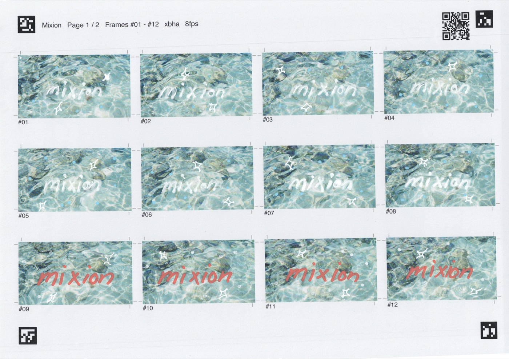
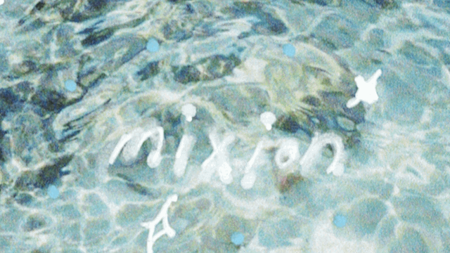
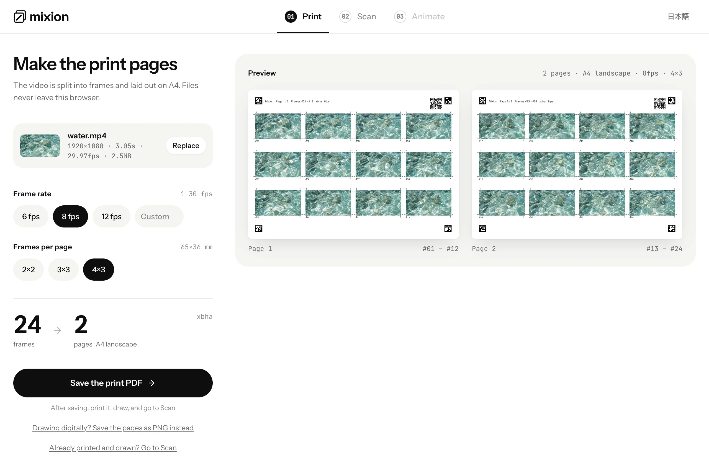
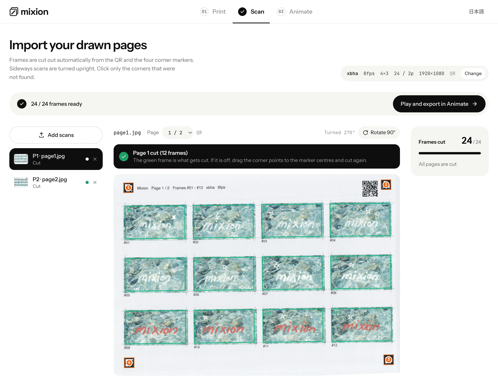
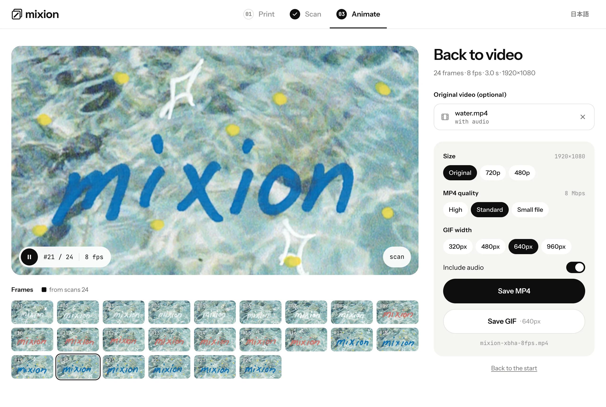

<p align="center">
  
</p>

<h1 align="center">Mixion</h1>

<p align="center">
  動画のフレームを紙に印刷して、描いて、スキャンして、アニメーションに戻す。
</p>

<p align="center">
  <a href="https://shunyakoide.github.io/mixion/"><strong>アプリを開く</strong></a> ·
  <a href="README.md">English</a>
</p>

<table align="center">
  <tr>
    <td align="center"></td>
    <td align="center"></td>
  </tr>
  <tr>
    <td align="center">描き込んだ後の印刷ページ</td>
    <td align="center">スキャンから作ったアニメーション</td>
  </tr>
</table>

Mixed Media Animation は、実写動画のコマの上に 1 枚ずつ紙の上で描き足したり、コラージュしたりして作るアニメーションです。描くのは楽しい。でも動画をコマに分けて、印刷用に並べて、スキャンをまた切り分けて、元の順番に戻す作業は楽しくありません。Mixion はその部分を引き受けます。

すべてブラウザの中で動きます。サーバーもアカウントもインストールも不要で、読み込んだものはどこにも送られません。印刷した各ページには設定入りの QR コードが載っているので、タブを閉じて、来週スキャンを持って別のマシンで開いても、Scan の工程から続きができます。

## 使い方

**1. Print.** 動画をドロップし、フレームレートと 1 ページあたりのコマ数を選んで PDF を保存します。縦動画は紙も縦向きになります。



**2. Draw.** A4 に印刷して、コマの上に描いたり塗ったり貼ったりします。四隅のマーカーと QR コードは汚さず、ページは切り離さないでください。

**3. Scan.** ページごとにスキャン（300 dpi で十分）してファイルを取り込みます。QR からページ番号と設定を読み、四隅のマーカーを見つけてページを起こし、全コマを切り出します。傾いていても横向きでも、スマホで撮った写真でも構いません。見つからなかった隅だけクリックします。



**4. Animate.** 結果を再生して、MP4 か GIF で保存します。元動画をドロップすると、音声を戻したり、スキャンしなかったコマを補ったりできます。



## プリンターなしで試す

- **デジタルで描く。** Print ステップの **ページを PNG で保存** を使うと、PDF の代わりに 1 ページ 1 枚の 300dpi の画像を ZIP でダウンロードします。Procreate や Clip Studio、Photoshop で開いて上のレイヤーに描き、各ページを同じサイズのまま PNG か JPEG に統合して書き出し、Scan に取り込みます。マーカーと QR はスキャンと同じように画像から読み取られます。
- 最初の画面の **Try the sample** は、同梱の 5 秒のクリップを読み込み、印刷ページを描画し、それをスキャンとして取り込んで Scan で止まります。ページを確認してから Animate に進めます。
- Scan ステップの小さなリンク **Preview the flow before printing** は、自分の動画で同じことをします。印刷する前にフレームレートとグリッドを決めるのに使えます。
- `?sample` を付けて開くと、サンプルが読み込まれた状態で始まります。

## 動作環境

- WebCodecs のあるブラウザ。Chrome または Edge 94 以降、Safari 16.4 以降、Firefox 130 以降です。iPhone の Safari では Scan と Animate、GIF の保存まで動きます。iPhone での MP4 書き出しはまだ試していません。古いブラウザではアプリの代わりに案内が表示されます。PDF・MP4・GIF の保存ダイアログは Chrome と Edge だけで、ほかのブラウザではダウンロードフォルダに保存されます。
- A4 が印刷できるプリンターと、スキャナーかスマホのカメラ。

UI は英語と日本語です。アプリがブラウザに保存するのは選んだ言語だけです。

## 開発

Node 24 が必要です（`.node-version`）。

```bash
npm install
npm run dev
```

`npm test` でユニットテスト、`npm run lint` で oxlint、`npm run build` で型チェックとビルドが走ります。コードの構成、疑似スキャンを作る開発用フック、サイトのデプロイ方法は [CONTRIBUTING.md](CONTRIBUTING.md) に書いてあります。Issue と Pull Request は英語でも日本語でも歓迎します。

## ライセンス

[MIT](LICENSE)
