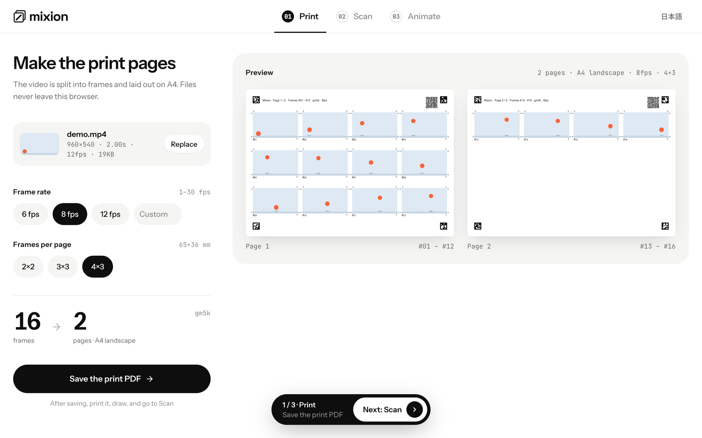
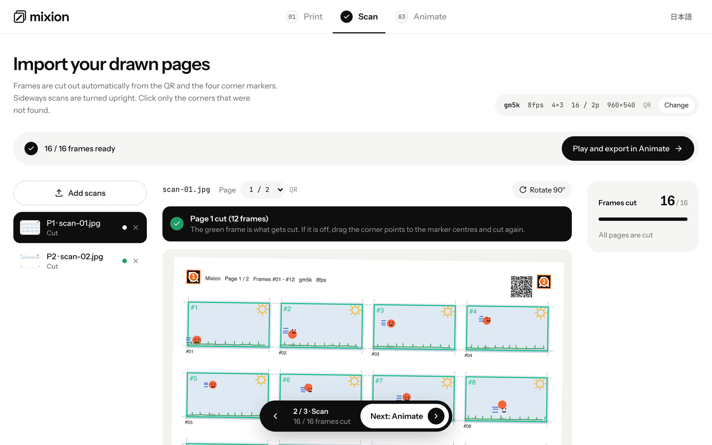
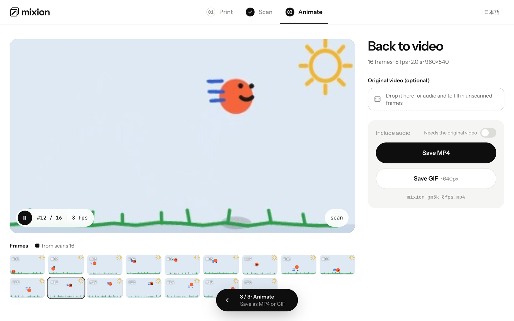

<p align="center">
  
</p>

<h1 align="center">Mixion</h1>

<p align="center">
  Print the frames of a video on paper, draw on them, scan them back, and get an animation.
</p>

<p align="center">
  <a href="https://shunyakoide.github.io/mixion/"><strong>Open the app</strong></a> ·
  <a href="README.ja.md">日本語</a>
</p>

<p align="center">
  <a href="https://github.com/shunyakoide/mixion/actions/workflows/ci.yml"></a>
  <a href="LICENSE"></a>
</p>

<table align="center">
  <tr>
    <td align="center"></td>
    <td align="center"></td>
  </tr>
  <tr>
    <td align="center">A printed page after drawing</td>
    <td align="center">The animation made from the scans</td>
  </tr>
</table>

## What is this?

Mixed media animation is drawing or collaging over the frames of a real video, one by one, on paper. The drawing is the fun part. Splitting the video into frames, laying them out for printing, cutting the scans up again and putting them back in order is not.

Mixion does the boring part. It runs entirely in your browser: there is no server, no account and nothing to install. Every printed page carries a QR code with the project settings, so the scan step reads everything it needs from the paper itself. Close the tab, come back next week with your scans, and carry on.

## How it works

**1. Print.** Drop a video, choose the frame rate and how many frames go on each page, and save the PDF. Vertical videos get portrait pages.



**2. Draw.** Print on A4 and draw, paint or paste on the frames. Keep the four corner markers and the QR code clean, and do not cut the pages apart.

**3. Scan.** Scan each page (300 dpi is plenty) and import the files. Mixion reads the settings and page number from the QR code, finds the corner markers, straightens the page and cuts out every frame. Crooked or sideways scans are fine. If a corner was not found, click it.



**4. Animate.** Play the result, optionally drop the original video to bring back its audio and fill in any frames you did not scan, then save as MP4 or GIF.



## Highlights

- **Nothing leaves the browser.** Video decoding, PDF generation, marker detection and MP4 encoding all happen locally.
- **Nothing to save.** The settings live in the QR code on every page. You can start from the Scan step on a fresh machine.
- **Scans just work.** Four ArUco markers and the QR code recover the page's position, rotation and number automatically. A phone photo works too: the perspective is corrected.
- **Vertical video** is supported, with portrait pages and matching grid options.
- **MP4 with the original audio**, or GIF.
- **English and Japanese** interface.

## Try it without a printer

- **Try the sample** on the first screen loads a bundled 5-second clip, renders its print pages as images, imports them as if they were scans, and takes you to Animate.
- **Preview the flow before printing** (a small link on the Scan step): after loading your own video, import its pages without printing them, to settle on the frame rate and grid first.
- Open the app with `?sample` to start with the sample clip loaded.

## Requirements

- Chrome or Edge. Mixion uses WebCodecs for video and the File System Access API for save dialogs; Safari and Firefox are not supported yet.
- A printer for A4 paper and a scanner (or a phone camera).

## Development

Requires Node 24 (see `.node-version`).

```bash
npm install
npm run dev
```

| Command | What it does |
|---|---|
| `npm run dev` | dev server |
| `npm run build` | type check + production build |
| `npm test` | vitest (`tests/`) |
| `npm run lint` | oxlint |

Dev-only hooks, available with `npm run dev`:

- `window.__dev` in the browser console: `simulateScan(page, {dpi, rotateDeg})` renders a print page as a fake scan; also `imageDiff`, `encodeMp4`, `encodeGif`, the stores and the marker/QR detectors.
- `window.__timings`: per-stage timings of the last scan import.

### Deployment

`.github/workflows/deploy.yml` builds with `BASE_PATH=/mixion/` on every push to `main` and publishes to GitHub Pages (Settings → Pages → Source must be "GitHub Actions"). To reproduce that build locally:

```bash
BASE_PATH=/mixion/ npm run build && npx vite preview --base /mixion/
```

## Under the hood

| Area | Built with | Used for |
|---|---|---|
| Build | Vite 8, TypeScript 6, Node 24 | dev server, type check, production build; `BASE_PATH` selects the deploy sub-path |
| UI | React 19, Tailwind CSS v4 | the screens; design tokens (colour, type, radius, shadow) live in `@theme` in `src/index.css` |
| Type | Instrument Sans, Noto Sans JP, JetBrains Mono, Space Grotesk (Google Fonts) | text, Japanese, numbers/IDs/file names, the wordmark |
| State | zustand | two stores (Print, Scan); nothing persisted except the locale |
| Video | WebCodecs via mediabunny | in-browser decoding (frame extraction) and MP4 encoding (H.264 + original audio) |
| GIF | gifenc | GIF export |
| PDF | pdf-lib | the A4 print PDF; shares its painting logic with the canvas preview |
| Markers / QR | own ArUco (MIP_36h12) detector and decoder, jsqr, qrcode | finding the corners, recovering orientation and page number, embedding and reading the page settings |
| Geometry | own homography | straightening scans and cutting out frames; heavy work runs in Web Workers |
| Validation | zod | the settings embedded in the QR code |
| Quality | vitest, oxlint, GitHub Actions (lint → test → build) | unit tests for the domain layer (layout, markers, homography, i18n parity) |
| Saving | File System Access API (`showSaveFilePicker`), download fallback | save dialogs for PDF / MP4 / GIF |

```
src/
  domain/      page layout (mm), frame mapping, homography, markers, QR settings. Pure TS, covered by vitest
  features/    the print / scan / animate screens and their logic
  lib/video/   decoding and MP4/GIF encoding on WebCodecs (mediabunny)
  workers/     the warp Web Worker
  app/         zustand stores, header stepper, bottom dock, dev helpers
  components/  Button / Chip / icons / logo
  i18n/        en (source) and ja dictionaries, locale switch
```

The UI language defaults to English and can be switched to Japanese from the header. The choice is stored in `localStorage` under `mixion.locale`; that is the only thing the app stores.

## Contributing

Issues and pull requests are welcome, in English or Japanese. See [CONTRIBUTING.md](CONTRIBUTING.md).

## License

[MIT](LICENSE)
